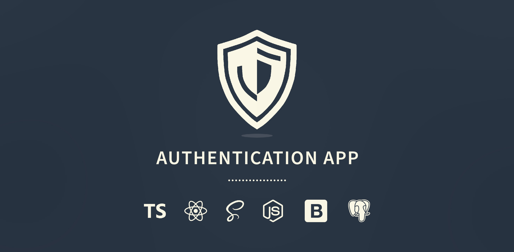

<div align="left">
  

---

<div align="center" width="100%">
<h4>Comprehensive Web Authentication Application<h4>
</div>

## Summary

The purpose of this project was to experiment with various authentication security methods.

## Key Features

- Email and Password Registration and Login
- Password Salting and Peppering
- Google and Github OAuth Authentication
- Two Factor Authentication
- Sessions Management
- Session Block System
- Session Activity Management
- Via Email Code Verification
- CSRF Token
- Database Management
- Cords and CSP Configuration
- Account Deletion
- Localization
- Set/Update Password

## Tools Used

- TypeScript
- React
- SCSS
- NodeJS
- Express
- Bootstrap
- PostgresDB
- _and more..._

## Setup Process

1. **Clone this repository**

```bash
  git clone https://github.com/Rukas90/ReactAuthApp.git
```

2. Install client packages

```bash
  cd client
```

```bash
  npm i
```

3. Generate _CSS_ files

   - Go to `client/src/Scss/main.scss`
   - Press `Watch Sass` button located at the bottom ribbon in VS Code

4. Create `.env.development` file in the `client` directory

```bash
cd client
```

```bash
touch .env.development
```

5. Add the server url to the `.env` file

```bash
VITE_API_URL=http://localhost:3000
```

6. Create `.env` file in the `server` directory

```bash
cd server
```

```bash
touch .env
```

7. **Setup Google OAuth Authentication**

   - Go to Google Developer Console `https://console.cloud.google.com/`
   - Create new Project (the name doesn't matter)
   - Go to `APIs & Services > Credentials`
   - Press `+ CREATE CREDENTIALS > OAuth client ID`
   - Fill in the OAuth details
     - Application type `Web Application`
     - Write a name `can be anything`
     - Add an authorized JavaScript origin `http://localhost:3000`
     - Add an authorized redirect URI `http://localhost:3000/auth/google/callback`
   - Press `Create`
   - Add following entries to your server `.env` file. The keys can be found under `Additional information`:
     - `GOOGLE_CLIENT_ID=[YourClientID]`
     - `GOOGLE_CLIENT_SECRET=[YourClientSecret]`

8. **Setup GitHub OAuth Authentication**

   - Go to `https://github.com/settings/developers`
   - Press `OAuth Apps > New OAuth App`
   - Fill in the OAuth Application details
     - Application name `can be anything`
     - Homepage URL `http://localhost:3000`
     - Authorization callback URL `http://localhost:3000/auth/github/callback`
     - Enable Device Flow `true`
   - Press `Register application`
   - Add following entries to your server `.env` file:
     - `GITHUB_CLIENT_ID=[YourClientID]`
     - `GITHUB_CLIENT_SECRET=[YourClientSecret]`
       _To get a client secret, you have to generate it_

9. **Setup Database**

   - Download and Install **pgAdmin 4**

     ```bash
      https://www.pgadmin.org/download/
     ```

   - Download and Install **PostgresSQL 16**

     ```bash
      https://www.enterprisedb.com/  download-postgresql-binaries
     ```

   - Open **pgAdmin 4**
   - Right click on `PostgresSQL 16 > Create > Database`
   - Fill in the database details:

     - Database (name): `can be anything`
     - Rest leave as is ...
       &nbsp;
       > **Notice:** All tables will be initialized automatically when the server will start

   - Add the database details to the `.env` server file:

     - `CLIENT_DB_USERNAME=postgres`
     - `CLIENT_DB_PASSWORD=[YourPassword]`
     - `DB_TB_NAME=[YourDatabaseName]`
     - `DB_PORT=[YourDatabasePort]`
       `To see the port, go to pgAdmin, right click on PostgresSQL 16 > Properties ... > Connection. There you will find the port that you need to use.`

10. **Email Configuration**
    Add the database details to the `.env` server file:

    - `SENDER_MAIL_SERVICE=gmail`
    - `SENDER_EMAIL_ADDRESS=[YourGmailEmailAddress]`
      &nbsp;
      > **Notice:** It is recommended to create a new Google noreply email account
    - `SENDER_EMAIL_PASSWORD=[YourAppPassword]`
      To create an app password, follow these steps:
      - Go to `https://myaccount.google.com/security?hl=en`
      - Press on `2-Step Verification`
      - Set it up, if not already
      - When the 2-Step verification is configured, go to `App passwords` section and press on the arrow button
      - Enter your app name
      - Press `Create`
      - You will then see the password that you have to put as your `SENDER_EMAIL_PASSWORD` in the env file

11. **Finish .env File Setup**
    Add additional required details to your server `.env` file:
    - `PEPPER_KEY=[GenerateRandomKey]`
    - `PASSPORT_SESSION_SECRET=[GenerateRandomKey]`
    - `SERVER_PORT=3000`
    - `TWOFA_SECRET_KEY=[GenerateRandomKey]`
    - `CLIENT_ORIGIN=http://localhost:5174`
      ```
        If your client uses a different port then  replace the default 5174 port number with the new port number.
      ```
      > **Notice:** The client origin in the env file must be the same as your actual client origin
    - `SAME_SITE=Strict`

> **Note:** To generate a random key you can use this online service: https://www.avast.com/random-password-generator

</div>
