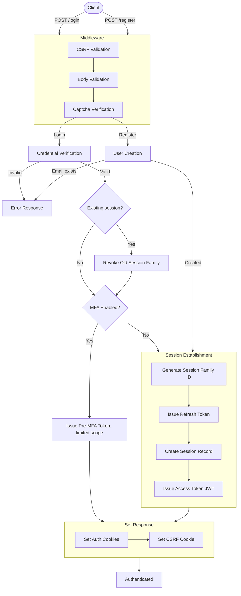
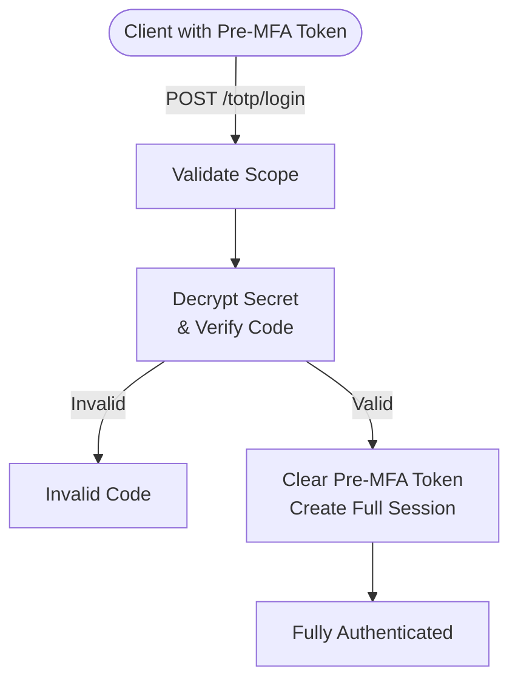
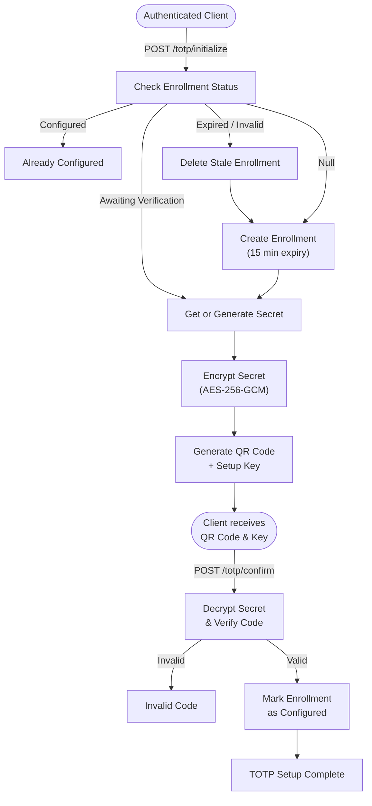

<h3>Secure Dashboard</h3>
<h4>Comprehensive Web Authentication Application</h4>

### Summary

A full-stack TypeScript monorepo implementing a comprehensive web authentication and account management system.

The server is an Express API backed by PostgreSQL via Prisma, with Redis for caching and BullMQ for background job processing. It implements a layered security architecture including JWT-based authorization with refresh token rotation, OAuth 2.0 (Google, GitHub), TOTP multi-factor authentication, OTP email verification using a verification code/token system with encrypted payloads, CSRF protection via stateless double-submit, session activity tracking and blocking, and rate limiting.

The client is a responsive React frontend built with Vite and Tailwind CSS, featuring i18n localization, and the shared workspace contains cross-cutting types, validation schemas, and security utilities used by both client and server. The project also includes account management, password recovery, and captcha protection, with errors handled in accordance with [RFC 9457](https://www.rfc-editor.org/rfc/rfc9457.html).

### Key Features

- Email and password registration and login
- Oauth authentication using Google and Github
- Totp multi-factor authentication
- Session block system
- Session activity management
- Verification code and token system
- Csrf double-submit protection
- Redis cache
- Account management
- Set/Update password
- Localization

### Techstack

- TypeScript
- React
- NodeJs
- Express
- Tailwind
- PostgresSQL
- Redis
- Prisma
- BullMq
- ...

### Run Locally

This project can be run locally. Below are the steps that are required to run this project on the local machine.

1. Clone repository
2. Create and configure `.env` files in both Client and Server following `.env.example` as guidelines
3. Build the shared project using `yarn build`
4. Install and run Redis in Docker
   For more information, visit: https://hub.docker.com/_/redis
5. Run both Client and Server projects using `yarn dev`
6. Go to client origin `http://www.127.0.0.1.sslip.io:5173`

### Functionality Flow Graphs

#### Authentication

#### MFA Authentication (e.g. TOTP)

#### MFA Setup (e.g. TOTP)

